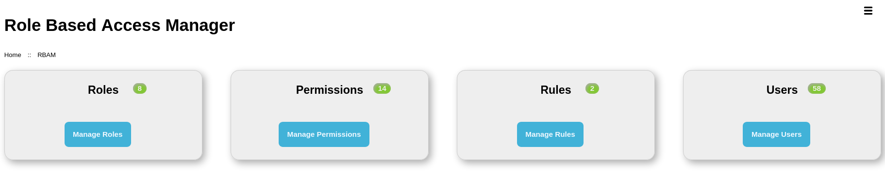

# RBAM Dashboard
## Overview
The dashboard shows an overview of RBAC Roles, Permissions, Rules, and Users.

For each of Permissions, Roles, Rules, Users, the number of each is shown.
Depending on the current user's role assignments, and hence permissions granted, there are buttons to manage each.

If the current user has the appropriate permission, there is a dropdown menu with one item - Clear RBAC.

The RBAM dashboard

## Managing Roles
Click `Manage Roles` to manage Roles.

A list of Roles is displayed with their descriptions, Rules used, and create and update datetimes.

Click `Create` to create a new Role.

Clicking `View` shows details of a Role, including a hierarchy diagram, child Roles,
Permissions granted, and assigned users.

Click `Update` to update a Role.

Click `Delete` to delete a Role.

See [Manage Roles](./manage-roles) for more details.

## Managing Permissions
Click `Manage Permissions` to manage Permissions.

A list of Permissions is displayed with their descriptions, Rules used, and create and update datetimes.

Click `Create` to create a new Permission.

Clicking `View` shows details of a Permission, including a hierarchy diagram, permitted users, and child Permissions.

Click `Update` to update a Permission.

Click `Delete` to delete a Permission.

See [Manage Permissions](./manage-permissions) for more details.

## Managing Rules
Click `Manage Rules` to manage Rules.

A list of Rules is displayed with the number of Roles and Permissions that use them.

Click `Create` to create a new Rule.

Clicking `View` shows details of a Rule, including the `execute()` method (this is the method that determines the Rule
result, and hence whether a Role or Permission using it is granted.

Click `Update` to update a Rule.

Click `Delete` to delete a Rule.

See [Manage Rules](./manage-rules) for more details.

## Managing Users
Click `Manage Users` to manage Users.

A list of users is displayed with the number of Roles that each is assigned and Permissions granted.

Clicking `View` shows the Roles assigned to the user and the Permissions granted; unassigned Roles are also listed.
Assigned Roles can be unassigned, and unassigned Roles can be assigned to the user. Permissions are updated accordingly.

See [Manage Users](./manage-users) for more details.

## Clear RBAC
Available in the `menu` button (top-right on the dashboard), `Clear RBAC` clears *all* RBAC items and hierarchy.

::: danger
Clearing RBAC will prohibit access to all parts of the application where RBAC controls access; this includes RBAM.

RBAC must be re-initialised to regain access.
:::

Selecting `Clear RBAC` shows a confirmation dialog. Clicking `Continue` shows a form that requires a code to be entered
to complete the action to ensure that the action can not be taken accidentally.

Click `Submit` to complete the action.