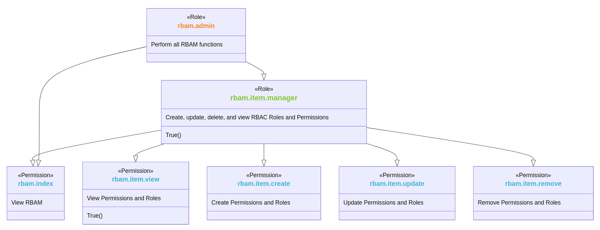

# Hierarchy Diagram
RBAM provides a hierarchy diagram for all Permissions and Roles. This shows where an item is in the hierarchy
in relation to its ancestors (if any) and descendants (if any).
The diagram is drawn using the `Mermaid Class Diagram package <https://mermaid.js.org/syntax/classDiagram.html>`__.

For each item the following information is shown (from top to bottom):

* Whether the item is a Permission or Role
* The item's name (Note: If the name contains spaces they are removed - this a feature of Mermaid, not RBAM)
* The item's description translated to the current locale
* Name of the Rule applied to the item (blank if no Rule is applied)

Clicking on an item in the diagram will go to that item's page.

Example hierarchy diagram (rbam.item.manager)