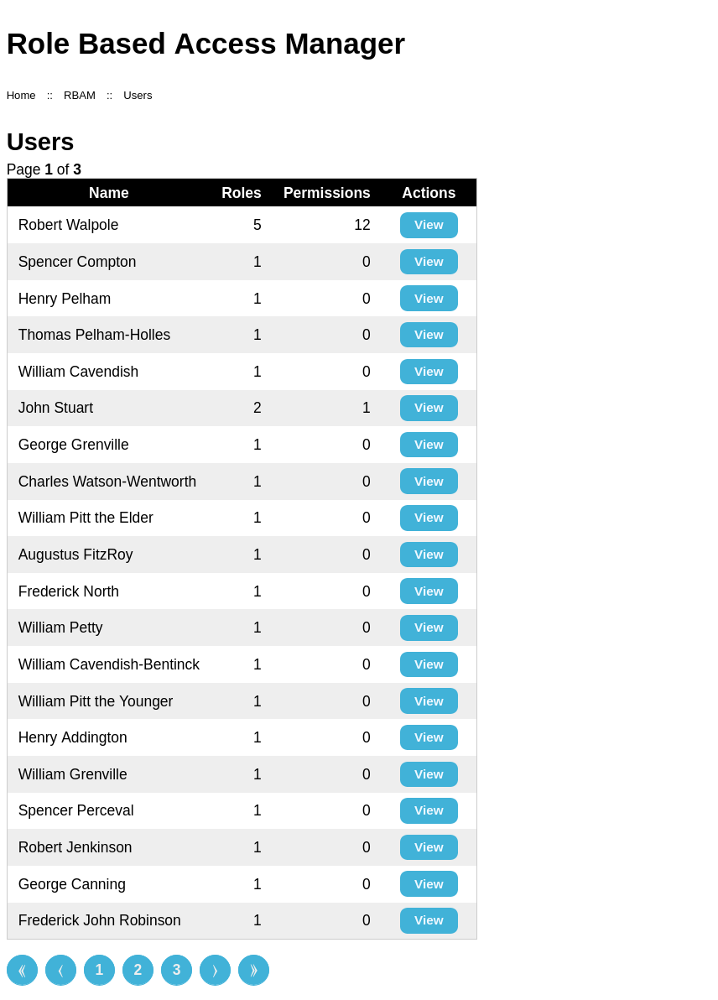
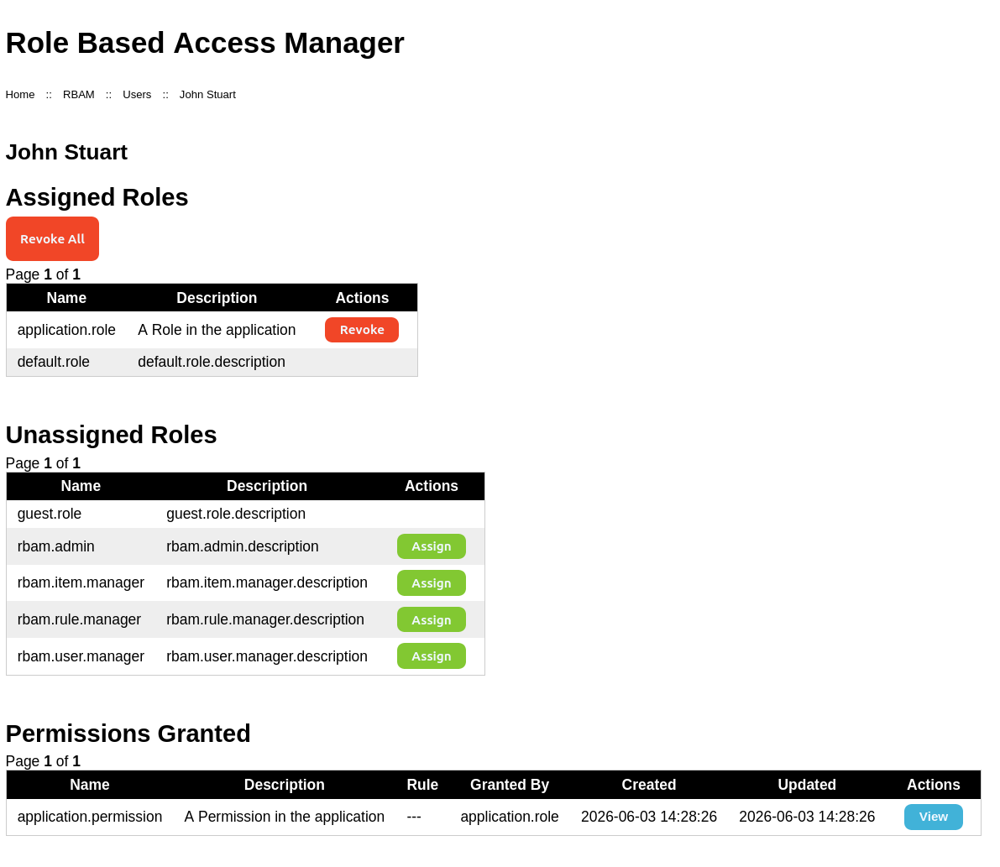

# Manage Users
This section describes how to manage Users within RBAM.

Managing Users consists of assigning and revoking Roles to/from users.
The Users themselves are defined elsewhere in the application.

## Users
The Users home page shows a paged list of users. For each user,
their name and the number of Roles assigned and Permissions granted is shown.

Users

## User
The user page shows the Roles assigned to a user, Roles not currently assigned, and Permissions that Role
assignments grant.

A user can be assigned a Role or inherit it; an inherited Role is a descendant of an assigned Role.

Roles can be assigned to and revoked from the user; Roles can be revoked individually or all Roles
can be revoked.

::: info
Inherited Roles can not be individually revoked.

To revoke an inherited role the assigned ancestor Role must be revoked,
or the inherited Role removed from the assigned Role's hierarchy.
:::

User Role Assignments View

### Role
To assign a Role to a user, click Assign button for an unassigned Role and confirm in the dialog.
The user will be assigned the Role, inherit any descendant Roles,
and granted Permissions associated with the assigned and inherited Roles.

::: info
The Guest Role can not be assigned
:::

### Role
To revoke a Role from a user, click the Revoke button for an assigned Role and confirm in the dialog.
The Role and any descendant Roles will be revoked, as will Permissions associated with all the revoked Roles.

::: info
Default Roles can not be revoked
:::

### Roles
Click the Revoke All button and confirm in the dialog.
All Roles (apart from any Default Roles) and Permissions will be revoked from the user.
