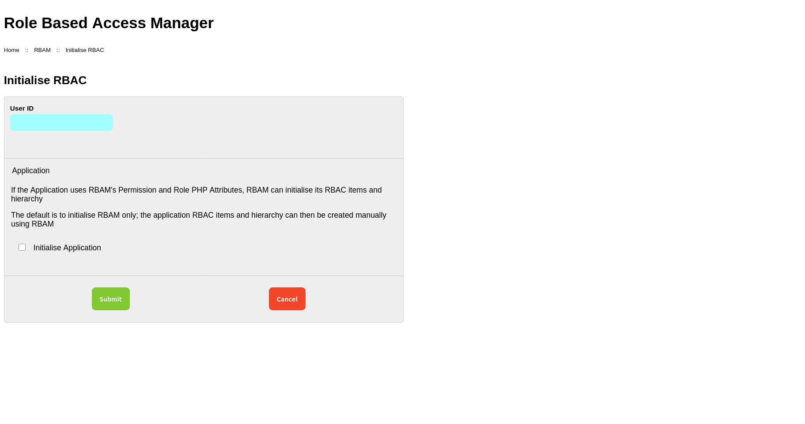
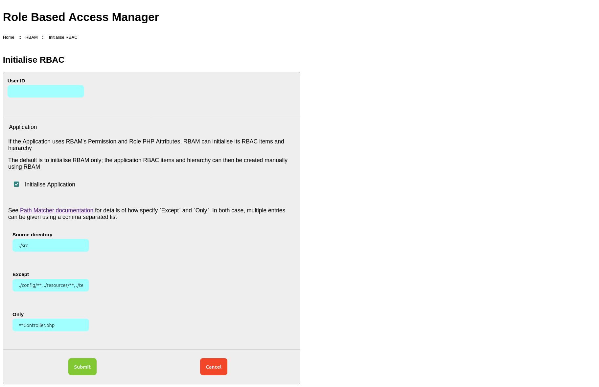

# RBAC Initialisation
Before RBAM can be used, RBAC must be initialised.

As a minium, RBAM's RBAC items and hierarchy must be initialised,
however RBAM can also initialise application RBAC items if it uses RBAM's [PHP Attributes](../attributes.md)
to define Permissions and Roles.

Initialisation is from RBAM's initialisation page. Navigate to `/rbam/initialise` and enter the user ID of the user
to be assigned the `rbam.admin` role; this role allows the specified user to perform all RBAM actions.

::: info
RBAM prevents initialisation if there are any RBAC Permissions or Roles defined.
:::

Initialise RBAM RBAC

## Initialising Application RBAC Items

For RBAM to initialise the application's RBAC items and hierarchy (as well as RBAM) the application *must* use
RBAM's [PHP Attributes](../attributes.md) to define Permissions and Roles.
If they are not used, application RBAC items and hierarchy can be created manually using RBAM.

If RBAM is to initialise the application's RBAC items, specify the following:

* Source Directory - The path to the application source directory relative to the application root directory
* Except - The pattern(s) to exclude directories from being inspected
* Only - The pattern(s) to define the files that should be inspected

::: info
See [Path Matcher documentation](https://github.com/yiisoft/files/tree/master#path-matchers)
for details of how specify `Except` and `Only`.
In both case, multiple entries can be given using a comma separated list.
:::

Initialise Application RBAC

## Initialising
Once the form is complete, click `Submit` to initialise RBAC.

Assuming that the current user is assigned the `rbam.admin` role, the [RBAM Dashboard](./dashboard) is displayed.
