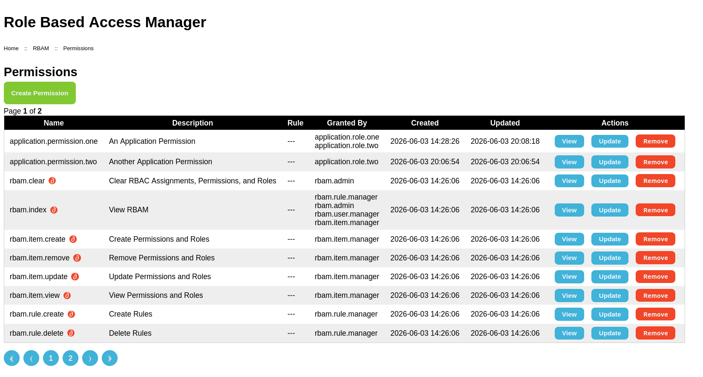
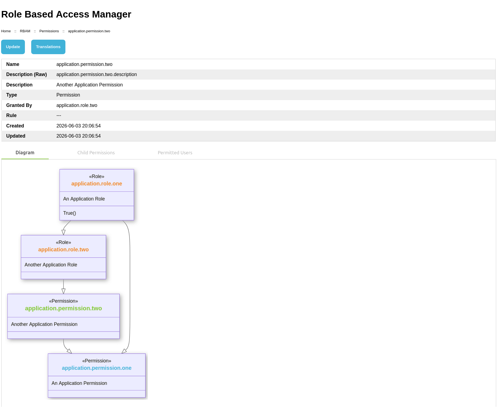
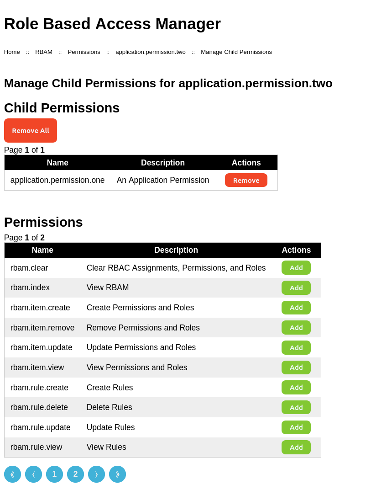
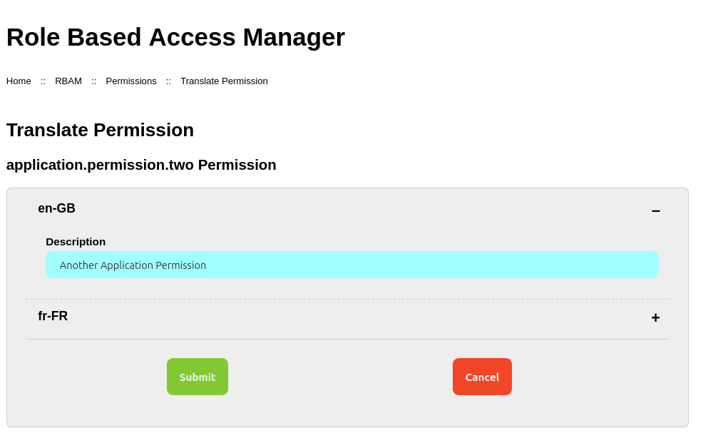
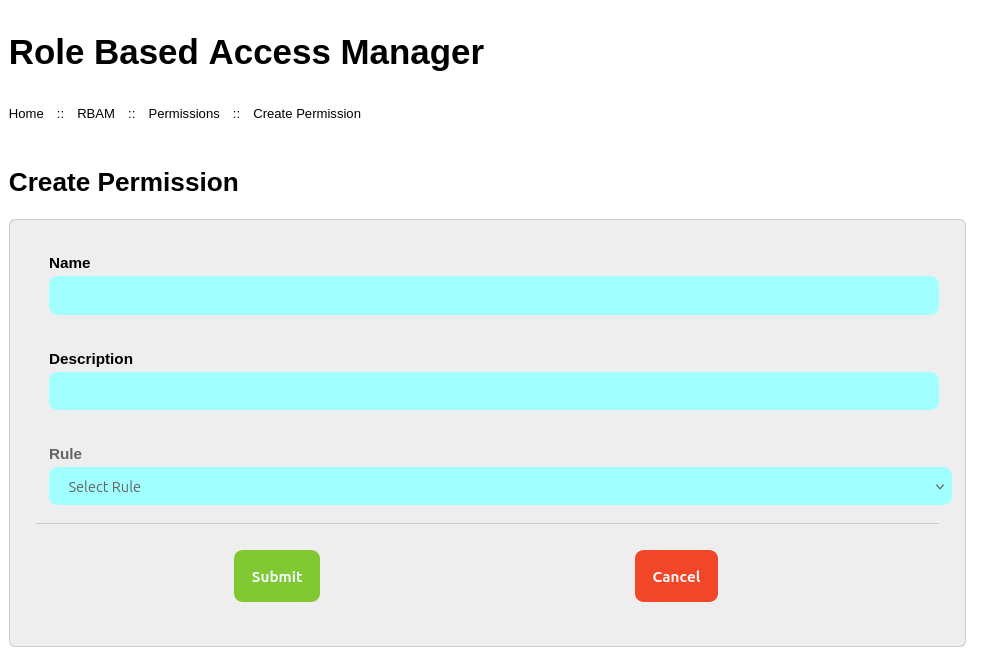
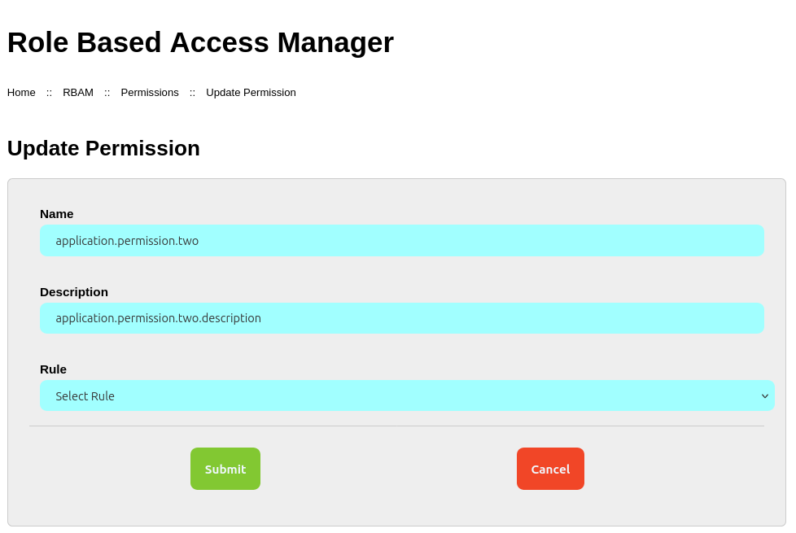

# Manage Permissions
This section describes how to manage Permissions within RBAM.

Managing Permissions consists of creating, updating, and deleting Permissions.

## Permissions
The Permissions home page contains a button to create a new Permission and a paged list of Permissions;
the following information is given for each Permission:

* Name of the Permission
* Description of the Permission - translated to the current locale (see [Internationalisation](../i18n))
* Name of the Rule, if any, that applies to the Permission
* Name of the Role(s) that grant the Permission
* Date and time the Permission was created
* Date and time the Permission was last updated
* Buttons to `View`, `Update`, or `Remove` the Permission

Permissions

## View a Permission
The Permission view page contains buttons to update the Permission and manage translations,
details of the Permission, and - in tabs - a [Hierarchy Diagram](./hierarchy-diagram) showing ancestors and descendants,
a list of `Child Permissions`, and a list of `Permitted Users`.

The `Child Permissions` tab contains a button to manage child Permissions of the current Permission.

The details shown for each Permission are:

* Name - Permission name
* Description - Permission description - both raw and translated to the current locale
* Rule - Name of the Rule, if any, applied to the Permission
* Created - Date and time the Permission was created
* Updated - Date and time the Permission was last updated

Permission View

### RBAM Permissions
RBAM Permissions are shown with the Part symbol (∂) in a red circle after the name.

## Manage Child Permissions
To see a list of Child Permissions, click the `Child Permissions` tab.

To manage Child Permissions, click the `Manage Child Permissions` button.

The page contains a list of Permissions that are currently children, and a list of Permissions that are not.

Permissions that are currently children can be removed.

::: info
The child Permission is not removed from RBAC; only the parent - child relationship is removed.
:::

Permissions that are not currently children can be added.

::: info
Not all Permissions can be added as a Child Permission.

Permissions that would create a circular reference can not be added as a Child Permission;
these Permissions do not have an `Add` button.
:::

Manage Child Permissions

## Translations
To create or update translations for the Permission description, click the `Translations` button.

Translations are listed by locale. To translate a locale, click on the locale to expand it and complete the form.

Repeat for all required locales then click `Submit`.

::: info
The translation may not immediately show in the Permission view; this is due to the way Yii caches translations.

Refresh the Permission view to see the translation.
:::

Translate Permission

## Create a Permission
To create a Permission, click the `Create` button on the Permissions index page then
complete the form. The form has the following fields:

* Name - The name of the Permission - Required
* Description - Description of the Permission - Required
* Rule - The Rule to be applied to the Permission - Optional

Create a Permission

## Update a Permission
The fields and requirements are the same as those for creating a Permission.

::: info
The name and description fields for RBAM Permissions can not be edited.
:::

If translations are used and the description is changed the current translations are moved to the new description.
If the translations themselves require updating this must be done after updating the Permission.

Update a Permission

## Remove a Permission
To remove a Permission, click the Remove button for the Permission and confirm the removal in the dialog.
The Permission will be removed from RBAC.

::: warning
Removing a Permissions *may* result in orphaned child Permissions.

The RBAC hierarchy should be checked following Permission removal.
:::